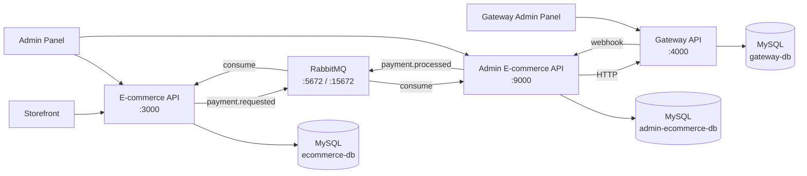
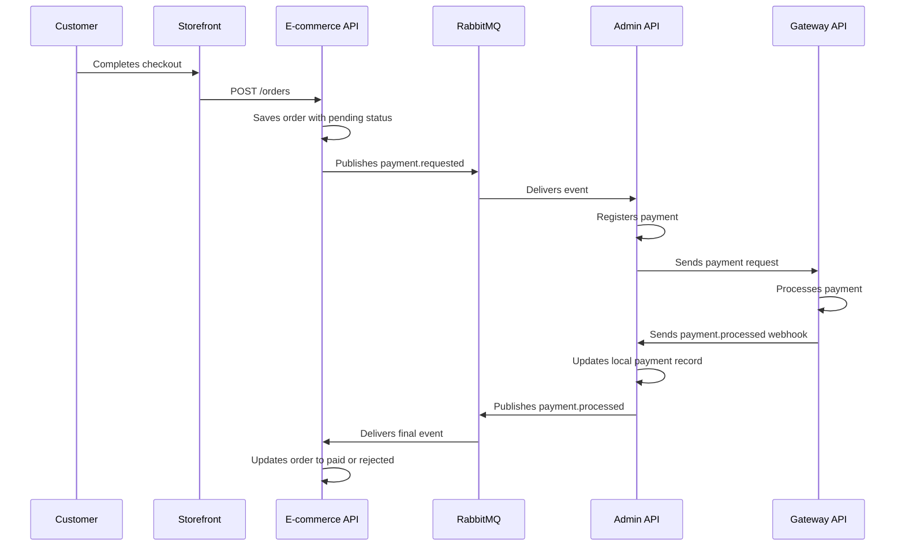
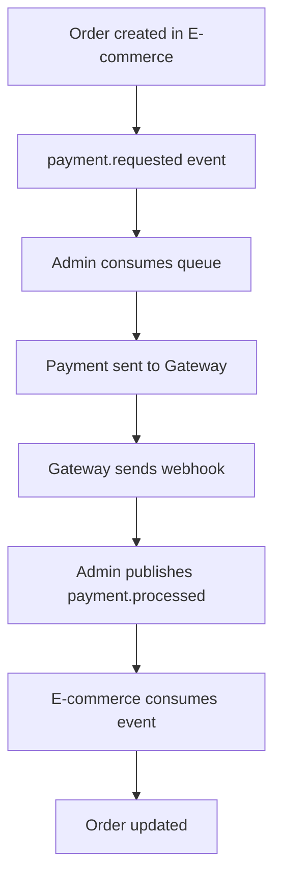

# E-commerce with Microservices, RabbitMQ, and Webhooks

This repository demonstrates a distributed purchase flow built with three Go APIs, three MySQL databases, asynchronous messaging with RabbitMQ, and three React interfaces used to operate the system.

The main goal is to show, in a practical way, how to separate responsibilities across services, use queues for decoupling, and complete the payment lifecycle through webhooks.

## Overview

The system is divided into three main areas:

- `ecommerce/api-ecommerce-example`: product catalog and order management.
- `api-admin-ecommerce-example`: payment backoffice and bridge between queue processing and the gateway.
- `gateway/gateway-payments-example`: payment gateway simulation.
- `frontend-ecommerce`: storefront for the end customer.
- `admin-ecommerce`: e-commerce admin panel.
- `gateway-admin-panel`: gateway operations panel.

## Architecture



## Payment Flow

The main flow implemented in the code is:



## Service Responsibilities

### 1. E-commerce API

Responsible for:

- creating, listing, retrieving, updating, and deleting items;
- creating orders;
- publishing `payment.requested` after an order is created;
- consuming `payment.processed` to update the final order status.

Order statuses in the flow:

- `pending`: order created and waiting for payment processing;
- `paid`: payment approved;
- `rejected`: payment rejected.

Main endpoints:

- `POST /items`
- `GET /items`
- `GET /items/{id}`
- `PUT /items/{id}`
- `DELETE /items/{id}`
- `POST /orders`
- `GET /orders`
- `GET /orders/{id}`
- `PUT /orders/{id}`

### 2. Admin E-commerce API

Responsible for:

- consuming the `payment.requested.queue`;
- creating the internal payment record linked to an order;
- forwarding the payment to the gateway;
- receiving the gateway webhook response;
- publishing `payment.processed` back to the e-commerce service;
- exposing backoffice endpoints for payment operations and queries.

Main endpoints:

- `PUT /payments/{id}`
- `POST /payments/{id}/process`
- `GET /payments/{id}`
- `GET /payments`
- `DELETE /payments/{id}`

### 3. Gateway API

Responsible for:

- simulating an external payment provider;
- persisting gateway-side payments;
- approving or rejecting transactions;
- notifying the Admin API through webhook callbacks.

Main endpoints:

- `POST /payments/`
- `GET /payments/`
- `GET /payments/{id}`
- `PUT /payments/{id}/status`
- `DELETE /payments/{id}`

Gateway payment statuses:

- `PENDING`
- `APPROVED`
- `REJECTED`

## Events and Asynchronous Contracts

The broker uses the `payments.exchange` exchange with two main routing keys:

- `payment.requested`
- `payment.processed`

Queues observed in the code:

- `payment.requested.queue`
- `payment.processed.queue`

Event flow diagram:



## Local Infrastructure

The `docker-compose.yml` file starts the following containers:

- `rabbitmq`
- `ecommerce-api`
- `api-admin-ecommerce`
- `gateway-api`
- `ecommerce-db`
- `admin-ecommerce-db`
- `gateway-db`
- `phpmyadmin`

Exposed ports:

| Service | Port |
|---|---:|
| E-commerce API | `3000` |
| Admin API | `9000` |
| Gateway API | `4000` |
| RabbitMQ AMQP | `5672` |
| RabbitMQ Management | `15672` |
| PHPMyAdmin | `8081` |

## How to Run

### Prerequisites

- Docker
- Docker Compose
- Node.js and npm, if you want to run the frontends outside containers

### 1. Start the infrastructure

```bash
docker-compose up -d --build
```

### 2. Create the tables

The SQL scripts are located at:

- `ecommerce/api-ecommerce-example/create_table.sql`
- `api-admin-ecommerce-example/create_table.sql`
- `gateway/gateway-payments-example/create_table.sql`

The compose file starts the databases, but table creation still depends on these scripts. You can import them through PHPMyAdmin at `http://localhost:8081` or by using a MySQL client inside the corresponding container.

### 3. Access support services

- RabbitMQ Management: `http://localhost:15672`
- default credentials: `guest / guest`
- PHPMyAdmin: `http://localhost:8081`

### 4. Start the frontends

Inside each folder below:

- `frontend-ecommerce`
- `admin-ecommerce`
- `gateway-admin-panel`

run:

```bash
npm install
npm run dev
```

## Frontend Target URLs

The frontend integrations currently point to:

- `frontend-ecommerce` -> `http://localhost:3000`
- `admin-ecommerce` -> `http://localhost:3000` and `http://localhost:9000`
- `gateway-admin-panel` -> `http://localhost:4000`

## Configurable Behaviors

In `docker-compose.yml`, there are two important flags:

- `AUTO_SEND_PAYMENTS=true` in the Admin API
- `AUTO_APPROVE_PAYMENTS=true` in the Gateway API

In practice:

- the Admin API can automatically forward payments to the gateway;
- the Gateway API can automatically approve payments as soon as they are created.

This makes it possible to test both automatic flows and flows manually operated through the panels.

## Repository Structure

```text
.
├── api-admin-ecommerce-example
├── admin-ecommerce
├── ecommerce
│   └── api-ecommerce-example
├── frontend-ecommerce
├── gateway
│   └── gateway-payments-example
├── gateway-admin-panel
└── docker-compose.yml
```

## Architectural Patterns Present

- microservices with isolated responsibilities;
- database per service;
- asynchronous event-based communication;
- synchronous HTTP integration between Admin API and Gateway API;
- webhook-based callback from the gateway;
- Go APIs organized with a Clean Architecture-inspired structure.

## Recommended Test Scenario

1. Start the environment with Docker.
2. Create a few items in the `E-commerce API` or through the admin panel.
3. Create an order from `frontend-ecommerce`.
4. Check the `payment.requested` event in RabbitMQ.
5. Track the payment in `admin-ecommerce` and `gateway-admin-panel`.
6. Confirm the final order status changes to `paid` or `rejected`.

## Notes

- This root README documents the integrated view of the full system.
- Each service also has its own internal structure and can be analyzed independently.
- The Mermaid diagrams above use syntax that is compatible with GitHub native rendering.
